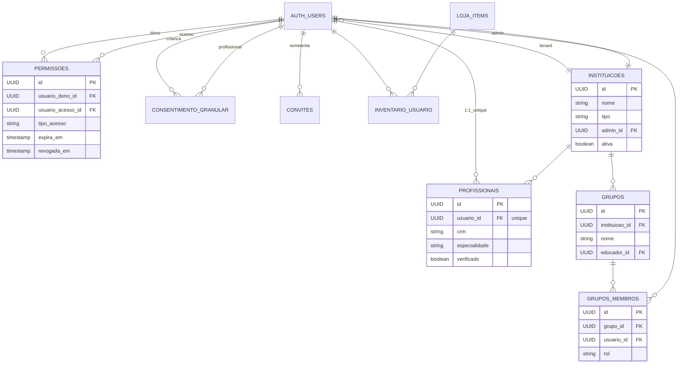

# Especificação Técnica - Entity Relationship Diagram (ERD)
## Arquitetura Multi-Portal Gamellito

**Data:** 2026-06-24  
**Versão:** 1.0  
**Status:** Rascunho Técnico

---

## Índice
1. [Visão Geral](#visão-geral)
2. [Estrutura de Tabelas](#estrutura-de-tabelas)
3. [Relacionamentos](#relacionamentos)
4. [Índices Recomendados](#índices-recomendados)
5. [Constraints e Regras](#constraints-e-regras)
6. [Diagrama Mermaid](#diagrama-mermaid)
7. [Notas de Implementação](#notas-de-implementação)

---

## Visão Geral

A arquitetura multi-portal do Gamellito requer um modelo de dados que suporte:

- **Multi-tenant**: Instituições educacionais com dados isolados
- **Multi-role**: Famílias, profissionais, educadores, instituições
- **Compartilhamento granular**: Controle fino de permissões entre usuários
- **Gamificação**: Moedas, inventário e loja
- **Auditoria**: Rastreamento de ações e consentimentos

As tabelas abaixo descrevem a estrutura completa do banco de dados PostgreSQL.

---

## Estrutura de Tabelas

### 1. auth.users (TABELA EXISTENTE - ALTERADA)

**Descrição:** Tabela de autenticação estendida com suporte a multi-tenant e roles.

```sql
TABLE auth.users {
  id                    UUID          [pk]
  email                 VARCHAR(255)  [unique, not null]
  encrypted_password    VARCHAR(255)  [not null]
  role                  VARCHAR(50)   [not null, check: 'admin|familia|profissional|educador|instituicao']
  tenant_id             UUID          [fk: instituicoes.id, nullable] -- NULL para familia/profissional independente
  email_confirmed       BOOLEAN       [default: false]
  email_confirmed_at    TIMESTAMPTZ   [nullable]
  last_sign_in_at       TIMESTAMPTZ   [nullable]
  created_at            TIMESTAMPTZ   [not null, default: now()]
  updated_at            TIMESTAMPTZ   [not null, default: now()]
  deleted_at            TIMESTAMPTZ   [nullable] -- soft delete
}

INDEXES:
  - (role, tenant_id)
  - (email)
  - (tenant_id)
```

**Alterações:**
- `role`: Novo campo com enum de roles
- `tenant_id`: Foreign key para instituições (multi-tenant)
- `email_confirmed`: Novo campo de confirmação
- `deleted_at`: Soft delete para auditoria

---

### 2. profissionais (NOVA)

**Descrição:** Registro de profissionais de saúde (médicos, nutricionistas, etc.).

```sql
TABLE profissionais {
  id                    UUID          [pk]
  usuario_id            UUID          [fk: auth.users.id, unique, not null]
  crm                   VARCHAR(50)   [unique, nullable] -- CRM/CREA/etc
  especialidade         VARCHAR(100)  [not null]
  instituicao_id        UUID          [fk: instituicoes.id, nullable]
  verificado            BOOLEAN       [default: false]
  verificado_em         TIMESTAMPTZ   [nullable]
  certificados_url      TEXT[]        [nullable] -- array de URLs
  bio                   TEXT          [nullable]
  created_at            TIMESTAMPTZ   [not null, default: now()]
  updated_at            TIMESTAMPTZ   [not null, default: now()]
}

INDEXES:
  - (usuario_id)
  - (verificado)
  - (instituicao_id)
  - (crm)
```

---

### 3. instituicoes (NOVA)

**Descrição:** Organizações (escolas, clínicas, hospitais) que usam a plataforma como tenant.

```sql
TABLE instituicoes {
  id                    UUID          [pk]
  nome                  VARCHAR(255)  [not null]
  tipo                  VARCHAR(50)   [not null, check: 'escola|clinica|hospital|ong|outro']
  cnpj                  VARCHAR(18)   [unique, nullable]
  email_contato         VARCHAR(255)  [not null]
  telefone              VARCHAR(20)   [nullable]
  endereco              TEXT          [nullable]
  cidade                VARCHAR(100)  [nullable]
  estado                VARCHAR(2)    [nullable]
  cep                   VARCHAR(8)    [nullable]
  website               VARCHAR(255)  [nullable]
  logo_url              TEXT          [nullable]
  ativa                 BOOLEAN       [default: true]
  admin_id              UUID          [fk: auth.users.id, not null]
  criada_em             TIMESTAMPTZ   [not null, default: now()]
  atualizada_em         TIMESTAMPTZ   [not null, default: now()]
}

INDEXES:
  - (cnpj)
  - (admin_id)
  - (tipo)
```

---

### 4. permissoes (NOVA)

**Descrição:** Compartilhamento granular de dados entre usuários (família → profissional).

```sql
TABLE permissoes {
  id                    UUID          [pk]
  usuario_dono_id       UUID          [fk: auth.users.id, not null] -- familia
  usuario_acesso_id     UUID          [fk: auth.users.id, not null] -- profissional
  tipo_acesso           VARCHAR(50)   [not null, check: 'readonly|comment|full']
  expira_em             TIMESTAMPTZ   [nullable] -- NULL = nunca expira
  revogada_em           TIMESTAMPTZ   [nullable] -- soft delete
  motivo_revogacao      VARCHAR(255)  [nullable]
  criada_em             TIMESTAMPTZ   [not null, default: now()]
  atualizada_em         TIMESTAMPTZ   [not null, default: now()]
}

UNIQUE CONSTRAINT:
  - (usuario_dono_id, usuario_acesso_id) -- uma permissão ativa por par

INDEXES:
  - (usuario_dono_id)
  - (usuario_acesso_id)
  - (expira_em)
```

**Tipos de acesso:**
- `readonly`: Apenas leitura de registros
- `comment`: Leitura + adicionar comentários/notas
- `full`: Leitura, comentários e edição de registros

---

### 5. grupos (NOVA)

**Descrição:** Agrupamentos de crianças por classe/turma dentro de uma instituição.

```sql
TABLE grupos {
  id                    UUID          [pk]
  instituicao_id        UUID          [fk: instituicoes.id, not null]
  nome                  VARCHAR(100)  [not null]
  descricao             TEXT          [nullable]
  educador_id           UUID          [fk: auth.users.id, nullable] -- educador responsável
  ativo                 BOOLEAN       [default: true]
  criado_em             TIMESTAMPTZ   [not null, default: now()]
  atualizado_em         TIMESTAMPTZ   [not null, default: now()]
}

UNIQUE CONSTRAINT:
  - (instituicao_id, nome) -- nome único por instituição

INDEXES:
  - (instituicao_id)
  - (educador_id)
```

---

### 6. grupos_membros (NOVA)

**Descrição:** Associação many-to-many entre grupos e crianças/usuários.

```sql
TABLE grupos_membros {
  id                    UUID          [pk]
  grupo_id              UUID          [fk: grupos.id, not null]
  usuario_id            UUID          [fk: auth.users.id, not null]
  rol                   VARCHAR(50)   [check: 'aluno|educador|responsavel']
  adicionado_em         TIMESTAMPTZ   [not null, default: now()]
  removido_em           TIMESTAMPTZ   [nullable]
}

UNIQUE CONSTRAINT:
  - (grupo_id, usuario_id) -- uma adesão ativa por grupo+usuário

INDEXES:
  - (grupo_id)
  - (usuario_id)
```

---

### 7. consentimento_granular (NOVA)

**Descrição:** Rastreamento de consentimentos para compartilhamento de dados específicos.

```sql
TABLE consentimento_granular {
  id                    UUID          [pk]
  usuario_crianca_id    UUID          [fk: auth.users.id, not null]
  usuario_profissional_id UUID        [fk: auth.users.id, not null]
  tipo_consentimento    VARCHAR(100)  [not null, check: 'registros_glicemia|registros_alimentacao|notas_clinicas|fotos|todos']
  consentimento_dado    BOOLEAN       [not null]
  data_consentimento    TIMESTAMPTZ   [not null]
  ip_origem             INET          [nullable]
  user_agent            TEXT          [nullable]
  revogado_em           TIMESTAMPTZ   [nullable]
  criado_em             TIMESTAMPTZ   [not null, default: now()]
}

INDEXES:
  - (usuario_crianca_id)
  - (usuario_profissional_id)
  - (data_consentimento)
```

---

### 8. convites (NOVA)

**Descrição:** Convites para compartilhar dados ou entrar em grupos.

```sql
TABLE convites {
  id                    UUID          [pk]
  usuario_remetente_id  UUID          [fk: auth.users.id, not null]
  email_destinatario    VARCHAR(255)  [not null]
  tipo_convite          VARCHAR(50)   [not null, check: 'compartilhar_dados|grupo|instituicao']
  dados_convite         JSONB         [not null] -- {crianca_id, tipo_acesso, etc}
  token_convite         VARCHAR(100)  [unique, not null] -- token para URL
  aceito                BOOLEAN       [default: false]
  aceito_em             TIMESTAMPTZ   [nullable]
  expirado              BOOLEAN       [default: false]
  expira_em             TIMESTAMPTZ   [not null]
  criado_em             TIMESTAMPTZ   [not null, default: now()]
}

INDEXES:
  - (token_convite)
  - (email_destinatario)
  - (usuario_remetente_id)
  - (expira_em)
```

---

### 9. loja_items (NOVA)

**Descrição:** Catálogo de itens disponíveis na loja (avatares, skins, etc).

```sql
TABLE loja_items {
  id                    UUID          [pk]
  nome                  VARCHAR(100)  [not null]
  descricao             TEXT          [nullable]
  tipo                  VARCHAR(50)   [not null, check: 'avatar|skin|emote|decoracao|outro']
  custo_moedas          INTEGER       [not null, check: '>0']
  imagem_url            TEXT          [not null]
  imagem_preview_url    TEXT          [nullable]
  ativo                 BOOLEAN       [default: true]
  quantidade_disponivel INTEGER       [nullable] -- NULL = infinito
  quantidade_vendida    INTEGER       [default: 0]
  ordem_exibicao        INTEGER       [default: 999]
  criado_em             TIMESTAMPTZ   [not null, default: now()]
  atualizado_em         TIMESTAMPTZ   [not null, default: now()]
}

INDEXES:
  - (tipo)
  - (ativo, ordem_exibicao)
```

---

### 10. inventario_usuario (NOVA)

**Descrição:** Itens da loja que o usuário possui.

```sql
TABLE inventario_usuario {
  id                    UUID          [pk]
  usuario_id            UUID          [fk: auth.users.id, not null]
  item_loja_id          UUID          [fk: loja_items.id, not null]
  quantidade            INTEGER       [default: 1, check: '>0']
  adquirido_em          TIMESTAMPTZ   [not null, default: now()]
  ativo                 BOOLEAN       [default: true] -- se está being usado
  data_ativacao         TIMESTAMPTZ   [nullable]
  data_desativacao      TIMESTAMPTZ   [nullable]
}

UNIQUE CONSTRAINT:
  - (usuario_id, item_loja_id) -- um item por usuário (agrupado por quantidade)

INDEXES:
  - (usuario_id)
  - (item_loja_id)
```

---

## Relacionamentos

### Diagrama Relacional (Texto)

```
┌─────────────────────────────────────────────────────────────────┐
│                          Estrutura Principal                      │
└─────────────────────────────────────────────────────────────────┘

auth.users (1) ──┬─→ (N) profissionais
                 ├─→ (N) permissoes (usuario_dono_id)
                 ├─→ (N) permissoes (usuario_acesso_id)
                 ├─→ (N) consentimento_granular (usuario_crianca_id)
                 ├─→ (N) consentimento_granular (usuario_profissional_id)
                 ├─→ (N) convites (usuario_remetente_id)
                 └─→ (N) inventario_usuario

auth.users (N) ──→ (1) instituicoes [tenant_id]

instituicoes (1) ──┬─→ (N) profissionais
                   ├─→ (N) grupos
                   └─→ (1) auth.users [admin_id]

grupos (1) ───────→ (N) grupos_membros
grupos_membros (N) ─→ (1) auth.users

permissoes: usuario_dono_id → usuario_acesso_id

consentimento_granular: usuario_crianca_id → usuario_profissional_id

loja_items (1) ───→ (N) inventario_usuario
inventario_usuario (N) → (1) auth.users
```

### Matriz de Relacionamentos

| Tabela 1 | Tabela 2 | Tipo | FK | Descrição |
|----------|----------|------|----|----|
| auth.users | instituicoes | N:1 | tenant_id | Usuário pertence a instituição |
| auth.users | profissionais | 1:1 | usuario_id (unique) | Usuário profissional tem perfil expandido |
| profissionais | instituicoes | N:1 | instituicao_id | Profissional vinculado a instituição |
| instituicoes | auth.users | N:1 | admin_id | Instituição tem administrador |
| grupos | instituicoes | N:1 | instituicao_id | Grupo pertence a instituição |
| grupos | auth.users | N:1 | educador_id | Educador responsável pelo grupo |
| grupos_membros | grupos | N:1 | grupo_id | Membro pertence ao grupo |
| grupos_membros | auth.users | N:1 | usuario_id | Usuário é membro do grupo |
| permissoes | auth.users | N:1 | usuario_dono_id | Dono do compartilhamento |
| permissoes | auth.users | N:1 | usuario_acesso_id | Receptor do acesso |
| consentimento_granular | auth.users | N:1 | usuario_crianca_id | Criança/responsável |
| consentimento_granular | auth.users | N:1 | usuario_profissional_id | Profissional |
| convites | auth.users | N:1 | usuario_remetente_id | Quem enviou o convite |
| loja_items | inventario_usuario | 1:N | item_loja_id | Item disponível na loja |
| auth.users | inventario_usuario | 1:N | usuario_id | Usuário possui itens |

---

## Índices Recomendados

### Por Performance

```sql
-- Índices para Permissões (consultas frequentes)
CREATE INDEX idx_permissoes_usuario_dono ON permissoes(usuario_dono_id)
  WHERE revogada_em IS NULL;
CREATE INDEX idx_permissoes_usuario_acesso ON permissoes(usuario_acesso_id)
  WHERE revogada_em IS NULL;
CREATE INDEX idx_permissoes_validade ON permissoes(expira_em)
  WHERE revogada_em IS NULL AND expira_em IS NOT NULL;

-- Índices para Autenticação
CREATE INDEX idx_users_role_tenant ON auth.users(role, tenant_id)
  WHERE deleted_at IS NULL;
CREATE INDEX idx_users_email ON auth.users(email)
  WHERE deleted_at IS NULL;

-- Índices para Profissionais
CREATE INDEX idx_profissionais_verificado ON profissionais(verificado)
  WHERE deleted_at IS NULL;
CREATE INDEX idx_profissionais_instituicao ON profissionais(instituicao_id);
CREATE INDEX idx_profissionais_crm ON profissionais(crm)
  WHERE crm IS NOT NULL;

-- Índices para Grupos
CREATE INDEX idx_grupos_instituicao ON grupos(instituicao_id);
CREATE INDEX idx_grupos_educador ON grupos(educador_id);
CREATE INDEX idx_grupos_membros_grupo ON grupos_membros(grupo_id)
  WHERE removido_em IS NULL;
CREATE INDEX idx_grupos_membros_usuario ON grupos_membros(usuario_id)
  WHERE removido_em IS NULL;

-- Índices para Consentimento
CREATE INDEX idx_consentimento_crianca ON consentimento_granular(usuario_crianca_id);
CREATE INDEX idx_consentimento_profissional ON consentimento_granular(usuario_profissional_id);
CREATE INDEX idx_consentimento_tipo ON consentimento_granular(tipo_consentimento);

-- Índices para Convites
CREATE INDEX idx_convites_token ON convites(token_convite);
CREATE INDEX idx_convites_destinatario ON convites(email_destinatario);
CREATE INDEX idx_convites_expiracao ON convites(expira_em);

-- Índices para Loja
CREATE INDEX idx_loja_items_tipo ON loja_items(tipo)
  WHERE ativo = true;
CREATE INDEX idx_loja_items_ordem ON loja_items(ordem_exibicao)
  WHERE ativo = true;
CREATE INDEX idx_inventario_usuario ON inventario_usuario(usuario_id);
CREATE INDEX idx_inventario_item ON inventario_usuario(item_loja_id);
```

### Índices Compostos para Queries Complexas

```sql
-- Combo: Profissional busca seus pacientes
CREATE INDEX idx_permissoes_acesso_ativo 
  ON permissoes(usuario_acesso_id, revogada_em, expira_em);

-- Combo: Verificar acesso rápido durante RLS
CREATE INDEX idx_permissoes_check_access 
  ON permissoes(usuario_dono_id, usuario_acesso_id, revogada_em, tipo_acesso);

-- Combo: Listar grupos de um educador/instituição
CREATE INDEX idx_grupos_instituicao_ativo
  ON grupos(instituicao_id, ativo);
```

---

## Constraints e Regras

### CHECK Constraints

```sql
-- auth.users
ALTER TABLE auth.users ADD CONSTRAINT check_role 
  CHECK (role IN ('admin', 'familia', 'profissional', 'educador', 'instituicao'));

-- instituicoes
ALTER TABLE instituicoes ADD CONSTRAINT check_tipo 
  CHECK (tipo IN ('escola', 'clinica', 'hospital', 'ong', 'outro'));

-- permissoes
ALTER TABLE permissoes ADD CONSTRAINT check_tipo_acesso 
  CHECK (tipo_acesso IN ('readonly', 'comment', 'full'));
ALTER TABLE permissoes ADD CONSTRAINT check_not_self 
  CHECK (usuario_dono_id != usuario_acesso_id);

-- grupos_membros
ALTER TABLE grupos_membros ADD CONSTRAINT check_rol 
  CHECK (rol IN ('aluno', 'educador', 'responsavel'));

-- consentimento_granular
ALTER TABLE consentimento_granular ADD CONSTRAINT check_tipo_consentimento 
  CHECK (tipo_consentimento IN ('registros_glicemia', 'registros_alimentacao', 'notas_clinicas', 'fotos', 'todos'));

-- convites
ALTER TABLE convites ADD CONSTRAINT check_tipo_convite 
  CHECK (tipo_convite IN ('compartilhar_dados', 'grupo', 'instituicao'));

-- loja_items
ALTER TABLE loja_items ADD CONSTRAINT check_custo 
  CHECK (custo_moedas > 0);
ALTER TABLE loja_items ADD CONSTRAINT check_tipo_item 
  CHECK (tipo IN ('avatar', 'skin', 'emote', 'decoracao', 'outro'));

-- inventario_usuario
ALTER TABLE inventario_usuario ADD CONSTRAINT check_quantidade 
  CHECK (quantidade > 0);
```

### UNIQUE Constraints

```sql
-- Um email por usuário (único globalmente)
CREATE UNIQUE INDEX idx_users_email_unique ON auth.users(LOWER(email));

-- Uma permissão ativa por par usuario
CREATE UNIQUE INDEX idx_permissoes_unique 
  ON permissoes(usuario_dono_id, usuario_acesso_id)
  WHERE revogada_em IS NULL;

-- Nome único por instituição
CREATE UNIQUE INDEX idx_grupos_nome_instituicao 
  ON grupos(instituicao_id, LOWER(nome))
  WHERE ativo = true;

-- Um item por usuário
CREATE UNIQUE INDEX idx_inventario_unique 
  ON inventario_usuario(usuario_id, item_loja_id);
```

### Foreign Key Constraints

```sql
-- Configurar com ON DELETE/UPDATE apropriados
ALTER TABLE auth.users
  ADD CONSTRAINT fk_users_tenant
  FOREIGN KEY (tenant_id) REFERENCES instituicoes(id)
    ON DELETE SET NULL
    ON UPDATE CASCADE;

ALTER TABLE profissionais
  ADD CONSTRAINT fk_profissionais_usuario
  FOREIGN KEY (usuario_id) REFERENCES auth.users(id)
    ON DELETE CASCADE
    ON UPDATE CASCADE;

ALTER TABLE profissionais
  ADD CONSTRAINT fk_profissionais_instituicao
  FOREIGN KEY (instituicao_id) REFERENCES instituicoes(id)
    ON DELETE SET NULL
    ON UPDATE CASCADE;

ALTER TABLE instituicoes
  ADD CONSTRAINT fk_instituicoes_admin
  FOREIGN KEY (admin_id) REFERENCES auth.users(id)
    ON DELETE RESTRICT
    ON UPDATE CASCADE;

-- ... similares para outras tabelas
```

---

## Diagrama Mermaid



---

## Notas de Implementação

### 1. Sequência de Migração Recomendada

1. **Fase 1 - Infraestrutura Base**
   - Alter `auth.users`: adicionar `role`, `tenant_id`, `email_confirmed`
   - Criar `instituicoes`
   - Criar índices essenciais

2. **Fase 2 - Profissionais e Permissões**
   - Criar `profissionais`
   - Criar `permissoes`
   - Criar índices de performance
   - Migrate dados de usuários existentes

3. **Fase 3 - Multi-Tenant e Grupos**
   - Criar `grupos`
   - Criar `grupos_membros`
   - Atualizar políticas RLS

4. **Fase 4 - Consentimento Granular**
   - Criar `consentimento_granular`
   - Integrar com Permissões

5. **Fase 5 - Convites**
   - Criar `convites`
   - Implementar fluxo de aceitação

6. **Fase 6 - Gamificação**
   - Criar `loja_items`
   - Criar `inventario_usuario`

### 2. Considerações de Performance

- **Índices Particionados:** Para tabelas muito grandes (permissoes, registros), considerar particionamento por `usuario_dono_id` ou por data.
- **Materialized Views:** Para dashboards de agregação (total pacientes, registros por período).
- **Cache Layer:** Permissões devem ser cacheadas em aplicação (Redis) com TTL de 5 minutos.

### 3. Dados de Teste

```sql
-- Seed de instituição
INSERT INTO instituicoes (id, nome, tipo, email_contato, admin_id, ativa)
VALUES ('550e8400-e29b-41d4-a716-446655440000', 'Escola Exemplo', 'escola', 'admin@escola.com', 'USER_ADMIN_ID', true);

-- Seed de profissional verificado
INSERT INTO profissionais (usuario_id, crm, especialidade, instituicao_id, verificado)
VALUES ('550e8400-e29b-41d4-a716-446655440001', 'CRM-123456', 'Nutrição', '550e8400-e29b-41d4-a716-446655440000', true);

-- Seed de item loja
INSERT INTO loja_items (nome, tipo, custo_moedas, imagem_url)
VALUES ('Avatar Dinossauro', 'avatar', 50, 'https://gamellito.com/avatares/dino.png');
```

### 4. Soft Deletes vs Hard Deletes

- **auth.users**: Soft delete (`deleted_at`) para preservar auditoria
- **permissoes**: Soft delete (`revogada_em`) para histórico de compartilhamentos
- **grupos_membros**: Soft delete (`removido_em`) para histórico de participação
- **Outras**: Hard delete é seguro (sem dados sensíveis duplicados)

### 5. Auditoria e Compliance

- Todas as tabelas devem ter `created_at` e `updated_at`
- `consentimento_granular` também registra `ip_origem` e `user_agent` para compliance LGPD
- Considerar tabela de audit log separada para ações críticas

---

**Próximas Etapas:**
- Documento ESPECIFICACAO-RLS-POLICIES.sql com todas as políticas de segurança
- Documento ESPECIFICACAO-APIS.md com endpoints detalhados
- Implementação de migrations no projeto
